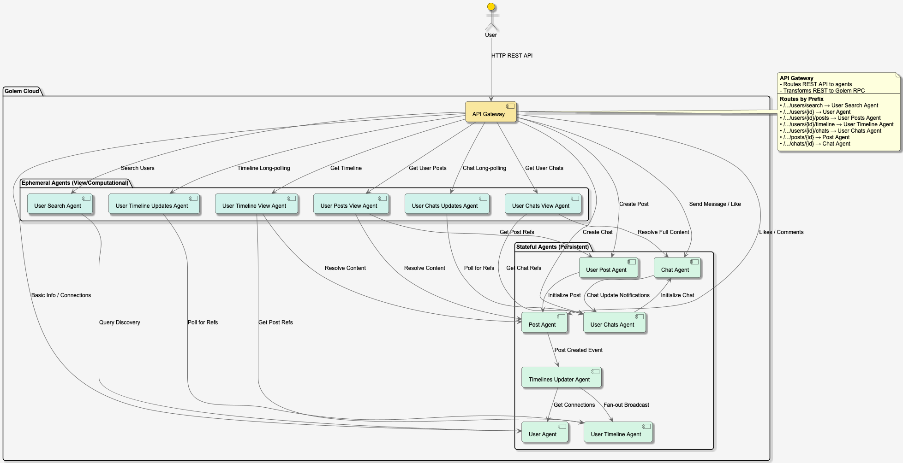

# Building a Decentralized Social Network with Golem Cloud Agents

In the evolving landscape of cloud computing, the concept of **agents** is reshaping how we think about distributed systems. Instead of monolithic backends or stateless microservices reliant on external databases, we can now build applications where data and logic coexist within autonomous, persistent entities.

In this post, we'll explore **Golem Social Net**, a proof-of-concept social networking application built on **Golem Cloud**. We'll dive into its agentic architecture, communication flows, and how specific agents are implemented in Rust.

## Overview: The Agentic Paradigm

Traditional web architectures often separate the "compute" (stateless servers) from the "storage" (databases). Golem Cloud challenges this by introducing **Stateful Workers** (Agents). An agent in Golem is a durable execution unit that maintains its own state in memory, which persists across restarts and upgrades.

In our social network, we don't have a central "User Database" or "Post Table". Instead:
- Every **User** is an independent agent.
- Every **Post** is an independent agent.
- Every **Chat** is an independent agent.

This granular approach allows for natural scalability and fault isolation. If one user's agent fails (which Golem handles gracefully), it doesn't bring down the entire system.

## Architecture

The system is composed of a constellation of agents, split into two main categories: **Stateful Agents** (persistent entities) and **Ephemeral Agents** (view aggregators and searchers).


*Figure 1: High-level Architecture of Golem Social Net*

### Communication Flow

The system manages interactions through a mix of direct RPC calls and event-driven patterns:

1.  **Request Entry**: The **API Gateway** receives REST requests and routes them to the specific agent (e.g., `GET /users/{id}` -> `User Agent {id}`).
2.  **Discovery**: A **User Search Agent** scans the network to discover specific `User Agents` matching a query.
3.  **Fan-out Distribution**: When a user creates a post:
    *   The **User Posts Agent** initializes a new **Post Agent**.
    *   The **Post Agent** triggers a "Post Created" event.
    *   A **Timelines Updater Agent** catches this event, looks up the author's followers, and "fans out" the post reference to their personal **User Timeline Agents**.
4.  **View Aggregation**: To show a timeline, a **User Timeline View Agent** queries the `User Timeline Agent` for a list of post IDs, then fetches the actual content from multiple `Post Agents` in parallel, constructing a complete view.

## Agent Design

Let's look at how these agents are defined in Rust. We use Golem's Rust SDK to define the behavior and state of our agents.

### 1. The User Agent

The `User Agent` is the digital twin of a user. It holds their profile data and connection graph (friends/followers).

```rust
#[derive(Schema, Clone, Serialize, Deserialize)]
pub struct User {
    pub user_id: String,
    pub name: Option<String>,
    pub email: Option<String>,
    pub connected_users: HashMap<String, ConnectedUser>,
    pub created_at: chrono::DateTime<chrono::Utc>,
    pub updated_at: chrono::DateTime<chrono::Utc>,
}

#[agent_definition]
trait UserAgent {
    fn new(id: String) -> Self;

    fn get_user(&self) -> Option<User>;

    fn set_name(&mut self, name: Option<String>) -> Result<(), String>;

    fn connect_user(
        &mut self,
        user_id: String,
        connection_type: UserConnectionType,
    ) -> Result<(), String>;

    // ... disconnect_user, etc.
}
```

Notice `get_user` simply returns `self.state.clone()`. There is no SQL query. The state is right there in memory.

### 2. The Post Agent

The `Post Agent` manages a single piece of content. It handles its own likes and comments. Interestingly, `Post Agent` is also responsible for triggering the updates that eventually propagate to timelines.

```rust
#[agent_definition]
trait PostAgent {
    fn new(id: String) -> Self;

    fn get_post(&self) -> Option<Post>;

    async fn init_post(&mut self, user_id: String, content: String) -> Result<(), String>;

    fn add_comment(
        &mut self,
        user_id: String,
        content: String,
        parent_comment_id: Option<String>,
    ) -> Result<String, String>;

    fn set_like(&mut self, user_id: String, like_type: LikeType) -> Result<(), String>;
}
```

When `init_post` is called, it not only initializes the state but also notifies the `TimelinesUpdaterAgent` to start the distribution process.

### 3. The Timelines Updater Agent (Orchestrator)

This agent acts as a background worker. It buffers updates and processes them to avoid blocking the user interaction.

```rust
#[agent_definition]
trait TimelinesUpdaterAgent {
    fn new(id: String) -> Self;

    fn get_updates(&self) -> PostUpdates;

    // Called by Post Agent
    async fn post_updated(&mut self, update: PostUpdate, process_immediately: bool);

    // Processes the buffer and fans out to followers
    async fn process_posts_updates(&mut self);
}
```

## Frontend

While the backend infrastructure is a novel network of agents, the frontend is a modern, familiar web application.

Built with **Vue 3**, **TypeScript**, and **Tailwind CSS**, it communicates with the Golem agents via a standard REST API exposed by the Golem Gateway. The frontend doesn't need to know it's talking to thousands of distributed agents; it just makes HTTP requests like any other SPA. All the complexity of routing to the correct agent is handled by the Golem infrastructure.

---

**Conclusion**

Golem Social Net demonstrates that complex, stateful applications can be built without managing databases or monolithic application servers. By treating every entity as an autonomous agent, we gain a system that is naturally modular, scalable, and resilient.


## Next Steps

1. Explore the [GitHub repository](https://github.com/justcoon/golem-social-net-rust)
2. Try deploying your own instance
3. Contribute to the project

## Resources

- [Golem Documentation](https://learn.golem.cloud/)
- [Rust Programming Language](https://www.rust-lang.org/)
- [WebAssembly](https://webassembly.org/)
